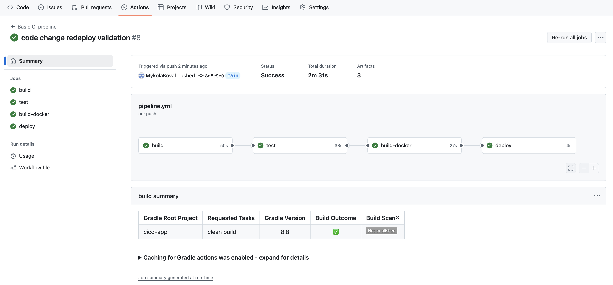

# HSA CI/CD

Docker commands:
```
docker build -t mvkoval/hsa-cicd-app .
docker push mvkoval/hsa-cicd-app
```

<h3>Task</h3>

- Setup CI/CD for your pet project (including deployment job to EC2)

<h3>Description</h3>

Prerequisites

1. Create EC2 instance through terraform (instance setup includes docker)
```
cd terraform
terraform init
terraform apply
```
2. Configure secrets for CI/CD pipeline
   - Docker Hub publish: DOCKERHUB_USERNAME, DOCKERHUB_TOKEN   
   - EC2 ssh connect: EC2_HOST, EC2_USERNAME, EC2_PRIVATE_KEY


Pipeline steps:



Published artifacts to Docker Hub:


Code redeployment validated:


